# 🧪 Laboratorio #3 – Generación Automática y Personalización de CRUD con Autenticación en Laravel
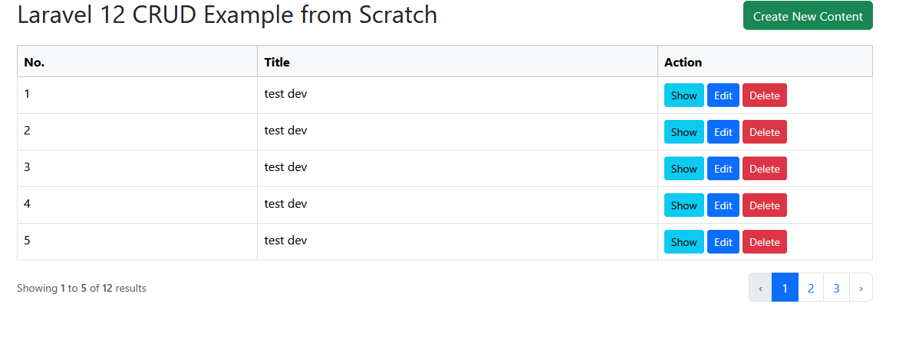


---

## 📑 Tabla de Contenido

1. Prerrequisitos  
2. Flujo de Comandos Utilizados  
3. Configuración Inicial y Optimizaciones  
4. Estructura de la Base de Datos  
5. Implementación del CRUD con Ibex  
6. Sistema de Autenticación  
7. Personalización de Vistas  
8. Definición de Rutas  
9. Arquitectura del Sistema  
10. Dificultades y Soluciones  
11. Capturas del Sistema  
12. Referencias  
13. Fecha de Ejecución  
14. Información del Estudiante  

---

## 1. 🛠️ Prerrequisitos (Ecosistema de desarrollo)

- 🪟 **Sistema Operativo:** Windows 11  
- 🐘 **PHP:** 8.2 / 8.3 / 8.5 (>= 8.0 requerido)  
- 🏗️ **Framework:** Laravel 13.x  
- 🛠️ **Servidor Local:** WampServer 3.3.0  
- 🌐 **Servidor Web:** Apache 2.4  
- 🗄️ **Base de Datos:** MySQL 8.4 / MariaDB 10.x  
- 💻 **Editor:** Visual Studio Code  
- ⚡ **Node.js / NPM:** v20.x (necesario para Vite)  
- 📦 **Composer:** última versión estable  

---

## 2. ⚙️ Flujo de Comandos Utilizados

```bash
# 1. Crear proyecto Laravel
laravel new proyecto

# 2. Crear Modelo + Migración + Controlador
php artisan make:model Product -m

# 3. Ejecutar migraciones
php artisan migrate

# 4. Instalar CRUD Generator (Ibex)
composer require ibex/crud-generator --dev
php artisan vendor:publish --tag=crud

# 5. Generar CRUD automático
php artisan make:crud products

# 6. Instalar autenticación Laravel UI
composer require laravel/ui
php artisan ui bootstrap --auth

# 7. Instalar dependencias frontend
npm install
npm run build

# Alternativa recomendada
composer run dev
```

---

## 3. 🔧 Configuración Inicial y Optimizaciones

### 🔹 Ajustes en `.env`

```env
PHP_CLI_SERVER_WORKERS=4
BCRYPT_ROUNDS=12
```

---

### 🔹 Solución Error 1071 (Longitud de índices)

Archivo: `app/Providers/AppServiceProvider.php`

```php
use Illuminate\Support\Facades\Schema;

public function boot(): void 
{
    Schema::defaultStringLength(191);
}
```

---

## 4. 🗄️ Estructura de la Base de Datos

```php
Schema::create('products', function (Blueprint $table) {
    $table->id();
    $table->string('description');
    $table->double('price', 8, 2);
    $table->integer('stock');
    $table->timestamps();
});
```

---

## 5. 🪄 Implementación del CRUD con Ibex

```bash
composer require ibex/crud-generator --dev
php artisan vendor:publish --tag=crud
php artisan make:crud products
```

Genera automáticamente:

- Modelo  
- Controlador  
- Requests  
- Vistas (index, create, edit, show, form)  

---

## 6. 🔐 Sistema de Autenticación

```bash
composer require laravel/ui
php artisan ui bootstrap --auth
npm install
npm run build
```

Permite:

- Registro  
- Login  
- Protección del sistema  

---

## 7. 🎨 Personalización de Vistas (Ajuste de Campos del CRUD)

El generador crea campos genéricos, por lo que se ajustaron manualmente para adaptarlos a la tabla `products`.

---

### 🔹 form.blade.php (Create y Edit)

```html
<div class="form-group">
    {{ Form::label('description', 'Descripción') }}
    {{ Form::text('description', $product->description, ['class' => 'form-control']) }}
</div>

<div class="form-group">
    {{ Form::label('price', 'Precio') }}
    {{ Form::text('price', $product->price, ['class' => 'form-control']) }}
</div>

<div class="form-group">
    {{ Form::label('stock', 'Stock') }}
    {{ Form::text('stock', $product->stock, ['class' => 'form-control']) }}
</div>
```

✔️ Se usa en **create** y **edit**

---

### 🔹 create.blade.php y edit.blade.php

```php
@include('product.form')
```

✔️ Reutilización de código

---

### 🔹 index.blade.php

```html
<th>Descripción</th>
<th>Precio</th>
<th>Stock</th>

<td>{{ $product->description }}</td>
<td>{{ number_format($product->price, 2) }}</td>
<td>{{ $product->stock }}</td>
```

✔️ Datos visibles correctamente

---

### 🔹 Modelo Product.php

```php
protected $fillable = ['description', 'price', 'stock'];
```

✔️ Permite guardar datos correctamente

---

## 8. 🛣️ Definición de Rutas

```php
use App\Http\Controllers\ProductController;

Auth::routes();

Route::get('/home', [App\Http\Controllers\HomeController::class, 'index'])->name('home');

Route::resource('products', ProductController::class);

Route::get('/products', [ProductController::class, 'index'])->name('products.index');
Route::get('/products/create', [ProductController::class, 'create'])->name('products.create');
Route::post('/products', [ProductController::class, 'store'])->name('products.store');
```

---

## 9. 🧱 Arquitectura del Sistema

1. Usuario se registra  
2. Usuario inicia sesión  
3. Accede al sistema  
4. CRUD protegido  
5. Gestión de productos  

---

## 10. ⚠️ Dificultades y Soluciones

- **Error 1071:** solucionado con `defaultStringLength`
- ### ⚠️ Error de Longitud (AppServiceProvider)
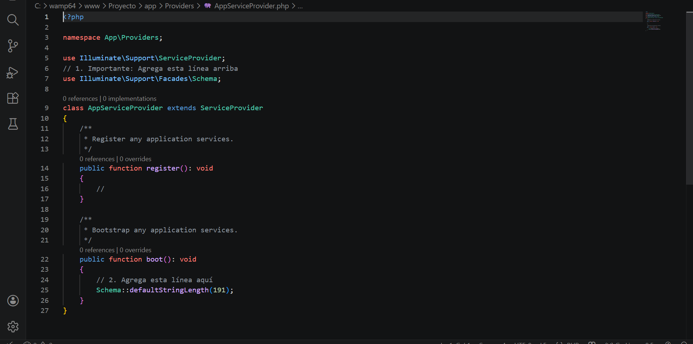

---

- **NPX no reconocido:** instalación de Node.js
- ### ⚡ Instalación de Node.js
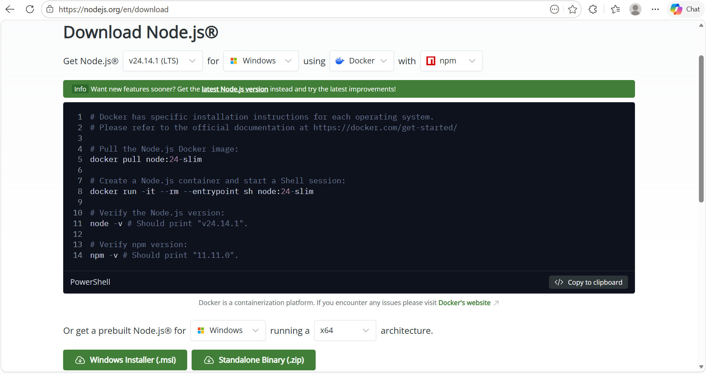

- **Dropdown/Logout:** Bootstrap CDN
 <link href="https://cdn.jsdelivr.net/npm/bootstrap@5.3.0/dist/css/bootstrap.min.css" rel="stylesheet">
<script src="https://cdn.jsdelivr.net/npm/bootstrap@5.3.0/dist/js/bootstrap.bundle.min.js"></script>
se agrega esta linea en el app blade si no le deja hacer logout justo antes de terminar el header


---

## 11. 📸 Capturas del Sistema

### 🏠 Dashboard (Vista principal)
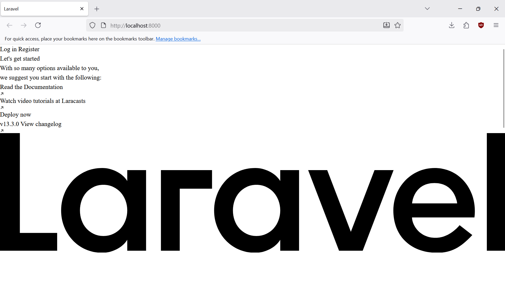

---

### 🔐 Login
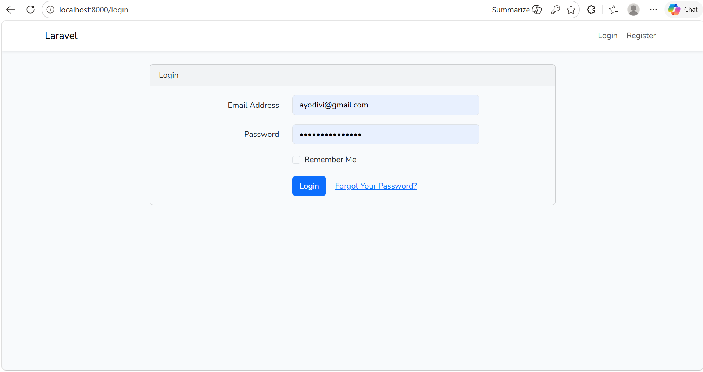

---

### 📝 Registro de Usuario
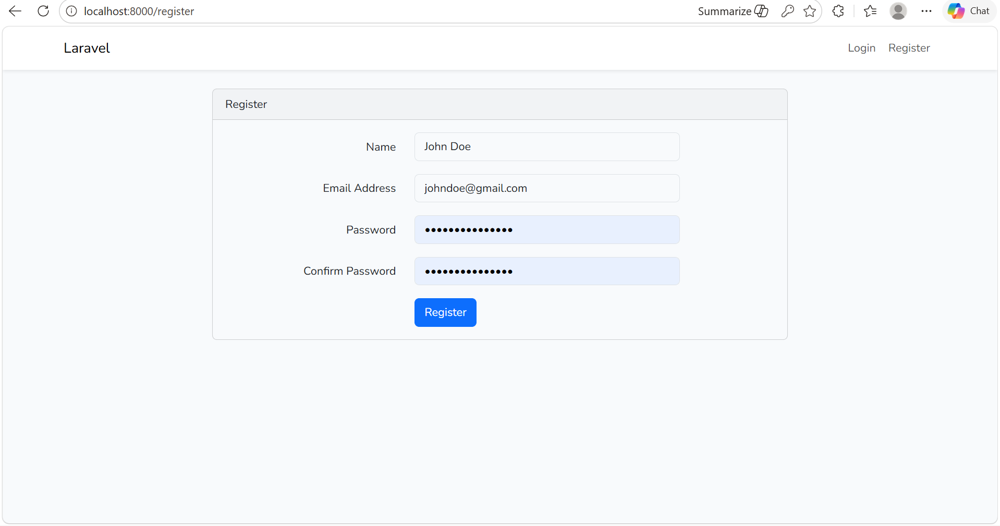

---

### 📦 CRUD de Productos
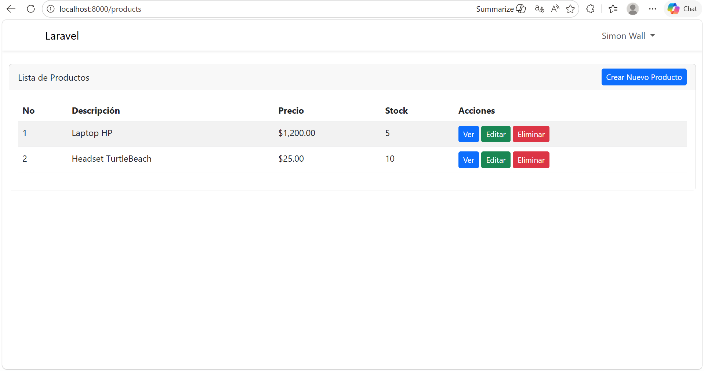

---

### ➕ Crear Producto
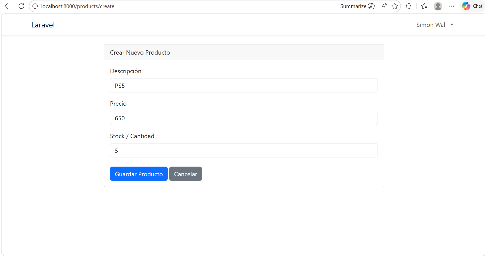

---

### 👁️ Ver Producto
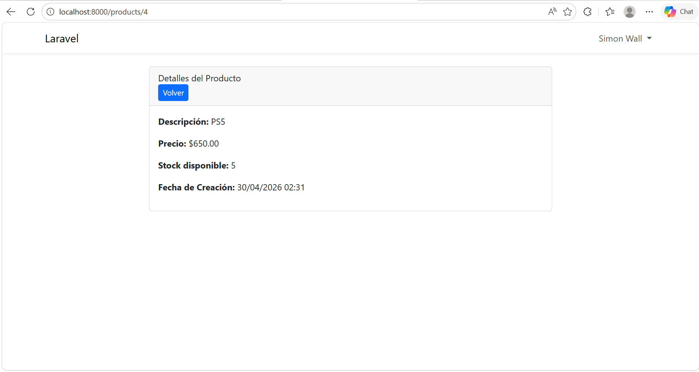

---

### ✏️ Editar Producto
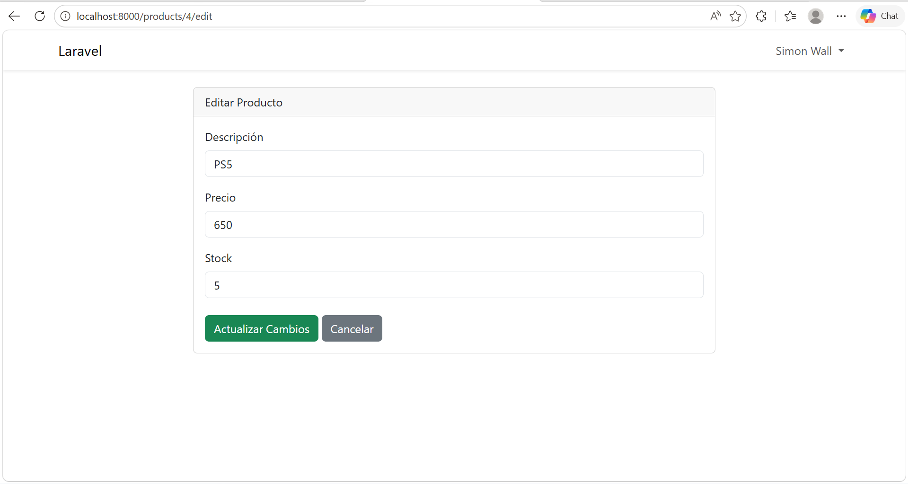


---
### ✏️ Resultado de Editar
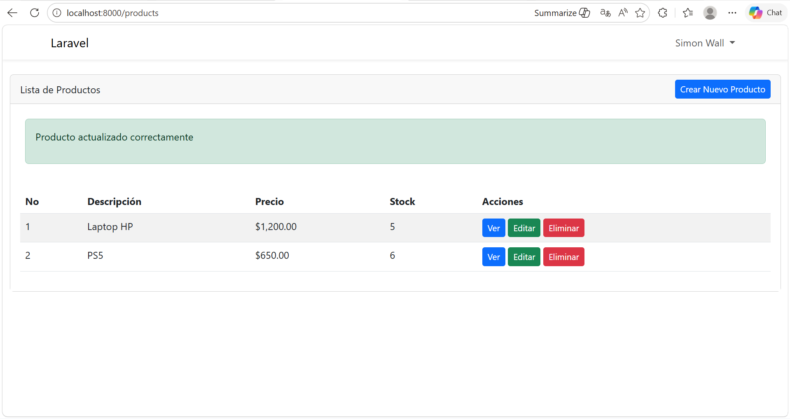

---

### 🗑️ Eliminar Producto
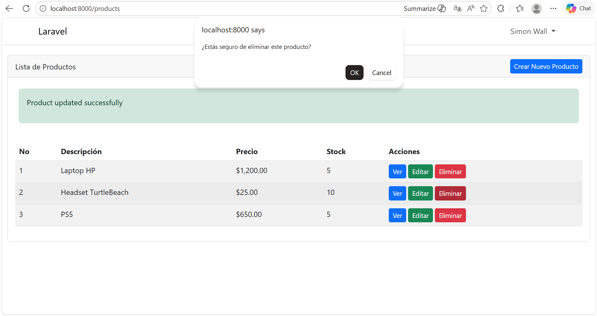

---


---

## 12. 📚 Referencias

- https://laravel.com/docs  
- https://github.com/laravel/ui  
- https://github.com/ibex/crud-generator  

---

## 📅 Fecha de Ejecución del Laboratorio

- **Fecha:** 29 de abril de 2026  

---

## 📌 Información del Estudiante (Footer)

> Este laboratorio ha sido desarrollado por el estudiante de la Universidad Tecnológica de Panamá:

- **Nombre:** Ahmed Diaz  
- **Correo:** ahmed.diaz@utp.ac.pa  
- **Curso:** Desarrollo de Software VII  
- **Instructor del Laboratorio:** Irina Fong  

---
